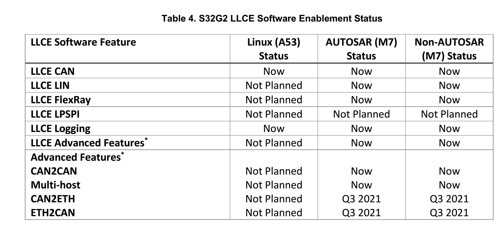

# software status

AN13423.pdf

This application note is a complementary to the LLCE 
Getting Started Guide and the LLCE firmware user 
guide for using CAN2CAN, CAN2ETH and ETH2CAN
in S32G.

LLCE has the capability 
to perform CAN frame routing between CAN channels 
(i.e. CAN2CAN) and between CAN and Ethernet (i.e. 
CAN2ETH / ETH2CAN) without host core’s 
intervention. 

TP-UNDERSTANDING-THE-S32G2-LLCE.pdf

# PFE

- PFE offloads the processing of Ethernet packets from the host cores, yielding higher performance and lower power than pure software processing can achieve.

Understanding the S32G2 Ethernet architecture - Training Presentation

## TP-LLCE-CAN-CAN-FD-SUPPORT-S32G-VNP-RDB2.pdf
- demos
- 60%

