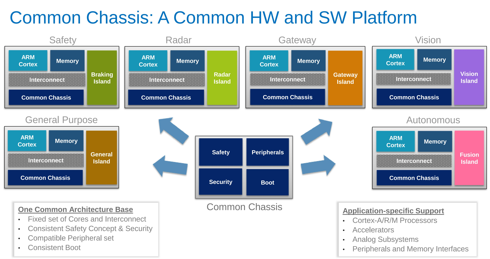
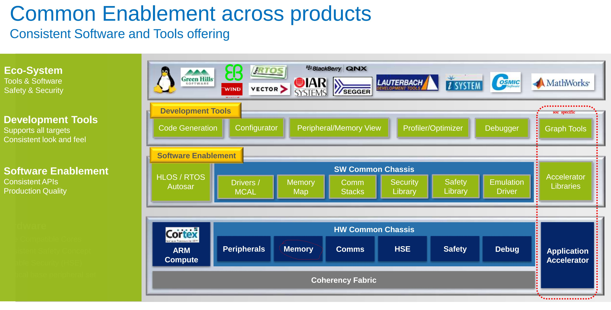
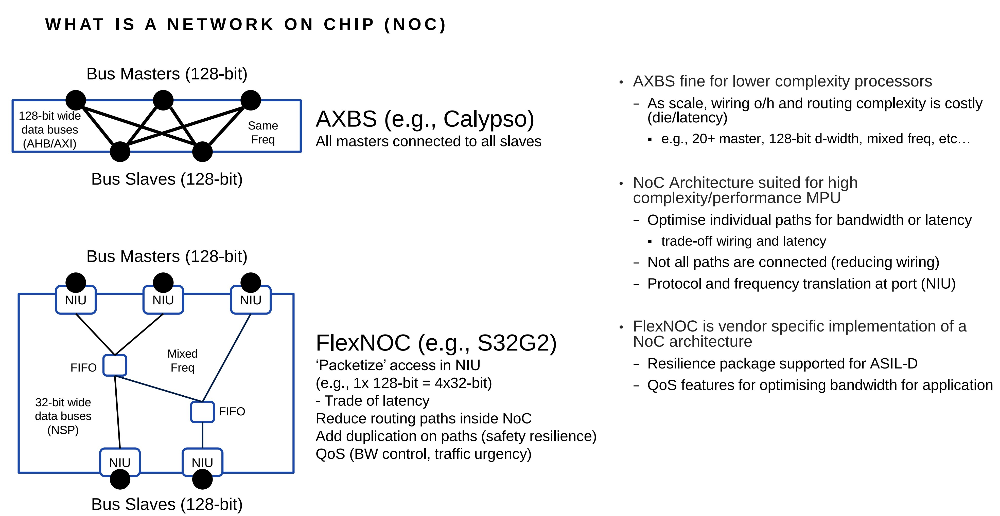

# hardware

## S32G2-CORES-PLATFORM.pdf

## S32_Common_Chassis_Overview

## glossary

### chassis
- APF-AUT-T3219_China.pdf

### ncore
- Arteris Ncore Cache Coherent Interconnect IP is Implemented by NXP
- Arteris Inc., the innovative supplier of silicon-proven commercial system-on-chip (SoC) interconnect IP, today announced that NXP Semiconductors has licensed Ncore cache coherent interconnect IP for use in its SoCs.

### FlexNoC
- The design teams at NXP have been long-time users of Arteris IP, having first licensed Arteris FlexNoC interconnect IP in 2011 and successfully implemented FlexNoC interconnects in its QorIQ network processing platform. The first implementation of Ncore interconnect IP in NXP is in heterogeneous cache coherent SoCs for next generation automotive MCU’s and processors.

### OTA
[OTA](https://www.telematicswire.net/nxps-automotive-processor-to-use-sibros-ota-connectivity-platform/)

### SIUL

# software

## johnli blog

[community link](https://community.nxp.com/t5/user/viewprofilepage/user-id/24888)

